# React performance task

Performance Before Optimization

### Initial render
* Render Duration - 74.1ms
* Interaction: Initial page load

Performance Metrics Screenshots

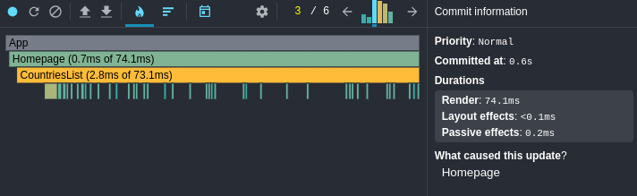
*Flame graph showing component render times*

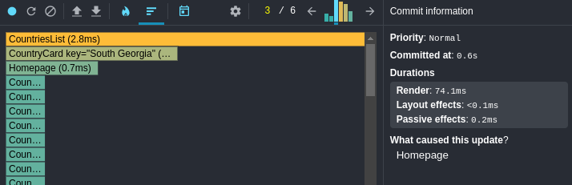
*Ranked chart of components by render duration*

### Sort by region
* Total Render Duration - 50.9ms (40.5ms + 10.4ms)
* First render: State update (40.5ms)
* Second render: List update (10.4ms)
* Interaction: Region filter change

Performance Metrics Screenshots

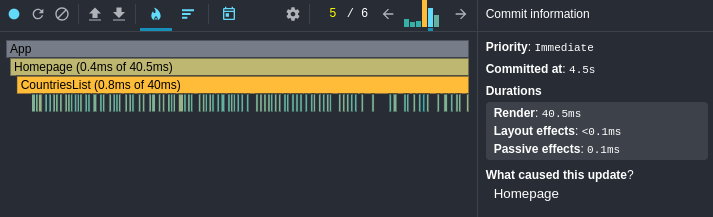
*Flame graph showing component render times during region sort*

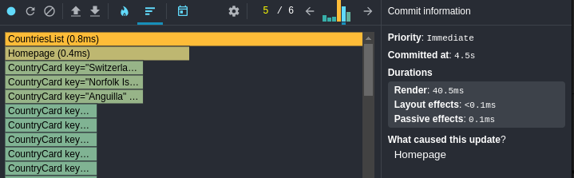
*Ranked chart of components by render duration during region sort*

### Sort by name
* Total Render Duration - 82.3ms (45.3ms + 37ms)
* First render: State update (45.3ms)
* Second render: List update (37ms)
* Interaction: Name sort change

Performance Metrics Screenshots

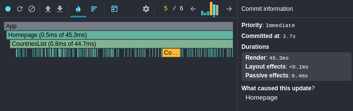
*Flame graph showing component render times during name sort*

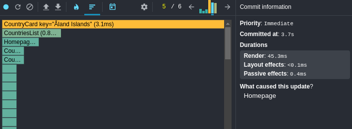
*Ranked chart of components by render duration during name sort*

### Sort by population
* Total Render Duration - 86ms (43.8ms + 42.2ms)
* First render: State update (43.8ms)
* Second render: List update (42.2ms)
* Interaction: Population sort change

Performance Metrics Screenshots

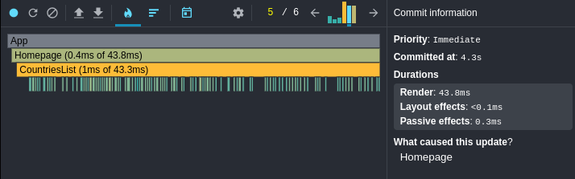
*Flame graph showing component render times during population sort*

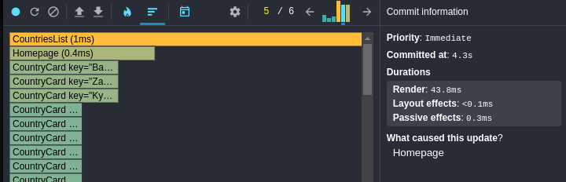
*Ranked chart of components by render duration during population sort*

### Search by name (letter "P")
* Total Render Duration - 44.4ms (39.2ms + 5.2ms)
* First render: State update (39.2ms)
* Second render: List update (5.2ms)
* For the rest of the letters render time is around 4ms+4ms
* Interaction: Search input change

Performance Metrics Screenshots

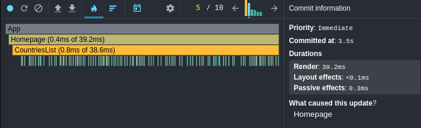
*Flame graph showing component render times during name search*

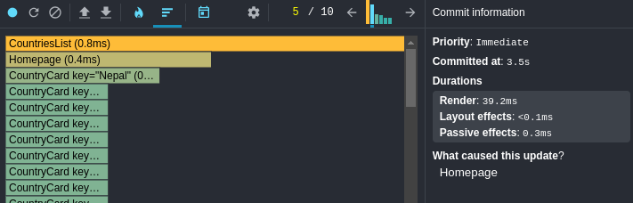
*Ranked chart of components by render duration during name search*

## Performance after optimization
**Summary**
By using performance related hooks and functions I managed to skip unnecessary re-renders of the components
and shorten render time during interaction by many times which is enormous.

## Optimization Techniques Used
- **React.memo**: To prevent unnecessary re-renders of components when their props haven't changed
- **useMemo**: To memoize expensive computations and prevent recalculation on every render
- **useCallback**: To memoize callback functions

### Performance Improvements Summary
| Operation | Before | After | Improvement |
|-----------|---------|--------|-------------|
| Initial Render | 74.1ms | 66.8ms | 9.8% faster |
| Sort by Region | 50.9ms | 1.3ms | 97.4% faster |
| Sort by Name | 82.3ms | 3.3ms | 96% faster |
| Sort by Population | 86ms | 3.9ms | 95.5% faster |
| Search by Name (first letter) | 44.4ms | 1ms | 97.7% faster |
| Search by Name (subsequent letters) | 8ms | 0.7ms | 91.3% faster |

### Initial render
* Render Duration - 66.8ms (previous 74.1ms)
* Interaction: Initial page load

Performance Metrics Screenshots

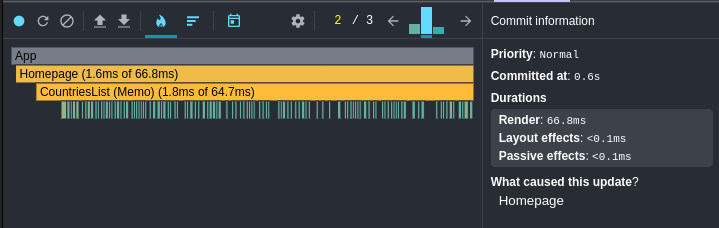
*Flame graph showing component render times*

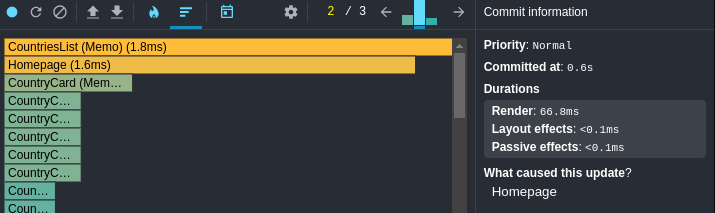
*Ranked chart of components by render duration*

### Sort by region
* Total Render Duration - 1.3ms (previous 50.9ms)
* Single render: State update and list update combined
* Interaction: Region filter change

Performance Metrics Screenshots

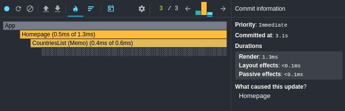
*Flame graph showing component render times during region sort*

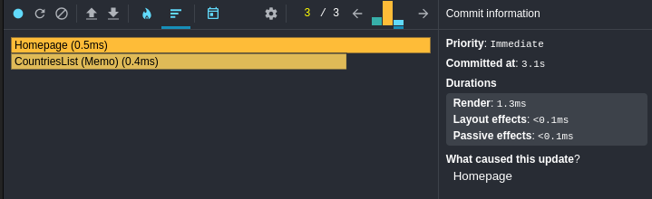
*Ranked chart of components by render duration during region sort*

### Sort by name
* Total Render Duration - 3.3ms (previous 82.3ms)
* Single render: State update and list update combined
* Interaction: Name sort change

Performance Metrics Screenshots

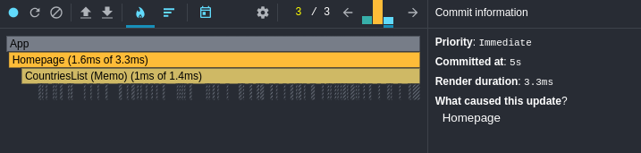
*Flame graph showing component render times during name sort*

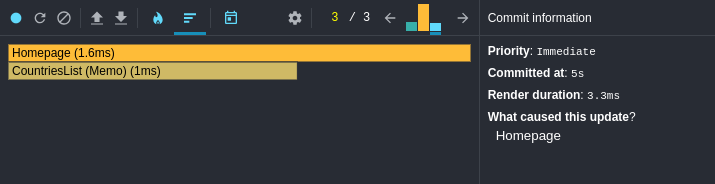
*Ranked chart of components by render duration during name sort*

### Sort by population
* Total Render Duration - 3.9ms (previous 86ms)
* Single render: State update and list update combined
* Interaction: Population sort change

Performance Metrics Screenshots

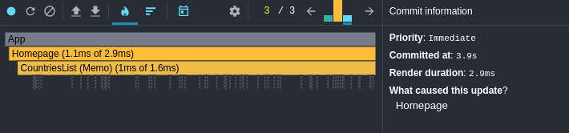
*Flame graph showing component render times during population sort*

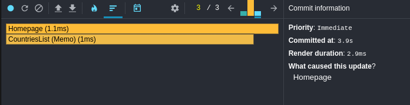
*Ranked chart of components by render duration during population sort*

### Search by name (letter "P")
* Total Render Duration - 1ms (previous 44.4ms)
* Subsequent letter renders: ~0.7ms (previous ~8ms)
* Interaction: Search input change

Performance Metrics Screenshots

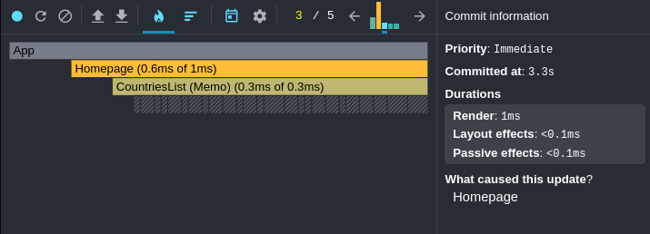
*Flame graph showing component render times during name search*

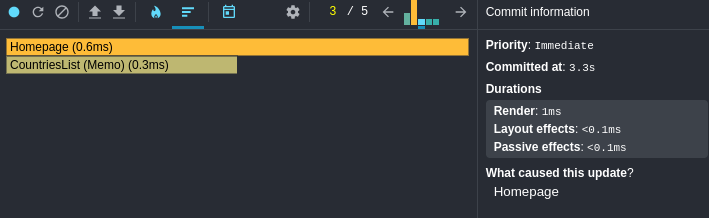
*Ranked chart of components by render duration during name search*

